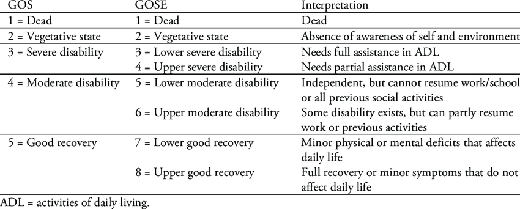

# Subarachnoid Hemorrhage Outcome Prediction

Repository for the outcome predictions of patients with SAH. 

[TOC]

### 1. Overview

Subarachnoid hemorrhage (SAH) is bleeding into the subarachnoid space- the area between the arachnoid membrane and the pia mater surrounding the brain. Symptoms may include a severe headache of rapid onset, vomiting, decreased level of consciousness, fever and sometimes seizures. Neck stiffness or neck pain are also relatively common. In about a quarter of people a small bleed with resolving symptoms occur within a month of a larger bleed.

There are several grading scales available for SAH. The Glasgow Outcome Scale is used as an international standard for assessing patient outcomes after 90 days of discharge from the hospital.

​														**Fig 1. Glasgow Outcome Scale**

### 2. Methods and Findings

This study uses Machine Learning and Neural Networks to assess the Quality of Life, Favourable/Unfavourable Prognosis and Fatal/Otherwise of stroke patients as a function of time. 

##### 2.1 GOS Output

Since the data was skewed, we were asked to incorporate weights into the features. After this, the max accuracy achieved by using ALL the features was 92%, but when Radiological Vasospasm, Clinical Ischemic Deficits and Outcome at discharge was left out, the Neural Network outperformed the Logistic Regression model by 7% with the maximum accuracy of 42% on validation. (Low accuracy was a result of skewedness/weighting of data and not performing feature engineering.)

##### 2.2 Favourable/Unfavourable Output

The logistic regression model outperformed the Neural Network model by 1% by hitting the maximum accuracy of 69.05% on validation data. Again, as instructed, the training was done on a reduced feature space with features having low correlation.

##### 2.3 Fatal/Otherwise Output

The neural network model outperformed on the Logistic regression model by 4% by hitting the maximum accuracy of 92.06% on validation data. Again, a reduced feature space was taken for training.

### 3. Conclusion

The results have implications for decision making of Medical Practitioners and provides an assessment of patient prognostication and for Clinical Trial purposes . New ML models based on trend data can be trained to greatly improve upon current risk management tools for stroke patients.

### 4. Datasets

The dataset is an original anonymized dataset of 800 patients. The training dataset has the following features, outcome at 3 months being the target feature.

- Age
- Sex 
- Hypertension 
- Diabetes
- WFNS Grade (World Federation of Neurological Surgeons Grading)
- Radiological Vasospasm
- Clinical Ischemic Deficits
- Outcome at Discharge

- Outcome at 3 months

### 5. Acknowledgements

This study was conducted using Data from Dept of Neurosurgery, KMC Manipal. Study was supported by the investigators of the project "Development of multi-stage neural network to predict sub-arachnoid hemorrhage patient outcomes using an international dataset of 800 aneurysmal sub-arachnoid hemorrhages. " from Baylor College of Medicine.

.

.